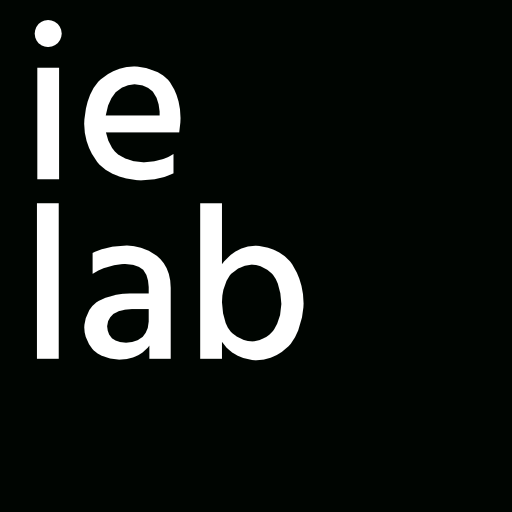

## Styleguide for content on ielab.io

### Structure of ielab.io

The landing page for `ielab.io` is contained in the `ielab.github.io` repository, in the file `index.md`.
We should include in the main website repository, i.e. `ielab.github.io` only core pages, including:

  * the index page (`index.md`)
  * pages containing student projects for recruitment, i.e. the `join-ielab.md` page or `opportunities.md`.
  * folders containing personal pages, or redirect to personal pages (more on thsi in the section "personal pages").
  * the `publications.md` page and the associated folder.

projects have a github pages into their individual repo

### Project pages

Each project should have a dedicate public ielab repository. 
This repository will contain the landing page for the project, along with any additional page, data, pdf/publication/preprint, resource, code that is made available to the public. 
You should not store in this repository the latex code that you used to create the paper, paper submissions that were not accepted/published, or any other material that you do not want to make public.

When naming a project (and creating the corresponding github repo):

      * use all lowercase letters, including for the first word, or for acronyms;
      * separate words by dashes i.e. `-`; not by underscores or similar;
      * use meaningful names; avoid naming a project after a conference or journal; avoid putting years in the project name

Note that a project may refer to multiple publications. The project page (the landing page) should contain:

* summary of idea/context
* key findings
* section for each publication and appendices, etc. this should contain:

      * abstract/summary
      * list of people involved (`ielab members involved in this project`; `external collaborators`)
      * link to pdf of publication/s
      * additional resources, if any: code, data, appendices, etc. These need to be stored in this public repository

#### Example

Let's work through an example scenario to visualise some of the guidelines. Assume we have a project about semantic similarity; the project resulted in a number of publications (CIKM 2015, ADCS 2015, a journal, etc). 

In this case, we would have a project repository under ielab.github.io, called `semantic-similarity`. In the landing page, we would have a short description of what this research is about: the investigation of semantic similarity measures within health.

The description should also highlight the key findings, with pointers of which publications reported these.
At the end of the description, we would have the list of key people involved in the project over time, e.g. `ielab members involved in this project: Bevan Koopman, Guido Zuccon`; `external collaborators: Lance De Vine`

Then the page should contain a section for each publication that stems for the project. So, for example, we would have a section about the CIKM 2015 paper, one about the ADCS 2015 paper and so on. Make sure the sections are temporaly ordered (in descending order, less recents on top).

Each of these sections may provide a brief summary of the publication (the abstract for example), link to resources and additional material (to be stored in the project repository), link to the pdf/preprint version of the publication, and so on.

### Personal pages

Once a new team member joins, a project repository is created for the ielab Github page to host the member's personal page. A personal page may be hosted within the actual GitHub space, or may redirect to a personal repository for another GitHub account, or a personal website hosted on a different solution. 

The project repository for the personal page should preferentially be the first name of the person. Shortening of names are fine (e.g. `harry` for `harrisen`), nicknames or usernames are fine too, although less preferred (e.g. `djlocke` vs `daniel`).

### Naming conventions

* ielab should be written all lowercase, i.e. `ielab`. ielab stands for Information Engineering Lab; so no need to say `ielab Lab`.
* when naming a project (and creating the corresponding github repo):
      
      * use all lowercase letters, including for the first word, or for acronyms;
      * separate words by dashes i.e. `-`; not by underscores or similar;
      * use meaningful names; avoid naming a project after a conference or journal; avoid putting years in the project name

### Branding

Use the following as you implement the logo into any ielab communications.

 - [Download png/svg assets](ielab_logos.zip)
 - [Download source (scribus)](ielab.sla)

### Publications page

more to be detailed once we work out Jekyll scholar
